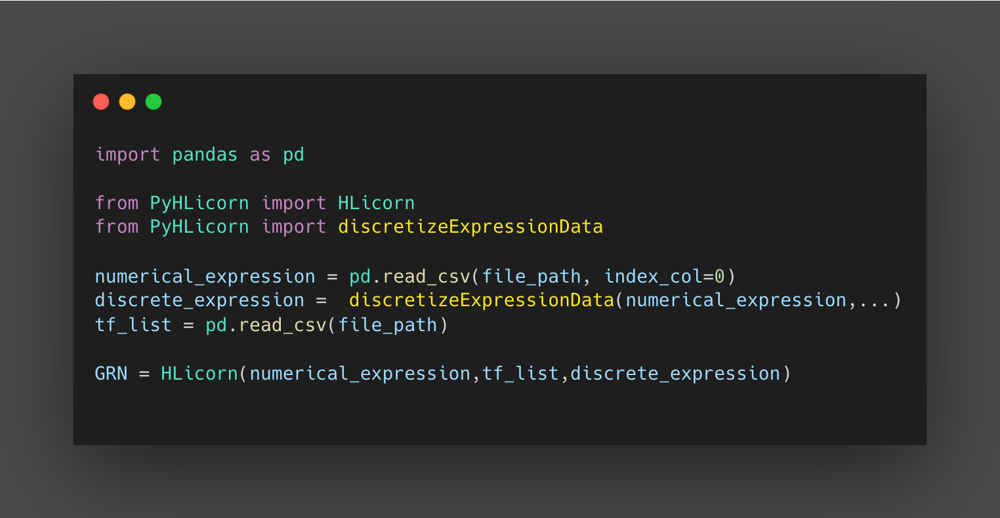

PyHLicorn
=========
After installing all the dependencies and requirements, import the Numerical Expression 
data as well as the gene list as intial paramaters for the HLicorn alogrithm to run. Check ... for details for the parametrs and 
 

.. .. automodule:: pyProject.core
..        :members:

.. .. currentmodule:: pyProject.core

.. autoclass:: pyProject.core.HLicorn
    :members:
    :inherited-members:
    :undoc-members:
    :show-inheritance:

